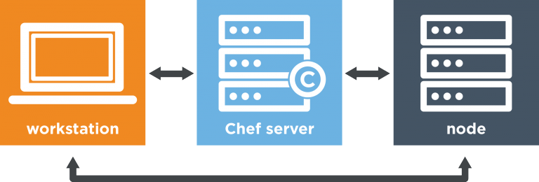

# chef_pihole
## Chef repo to provision PiHole DNS on RaspberryPi

### What does it do?
##### This repo is meant for a rapid provisioning of a RaspberryPi and PiHole DNS

### Summary of services installed
TODO Add Summary

### Dependencies
* A running Chef server
* 

### TODO
* Install Docker for ARM
* Install Docker-compose
* Install PiHole Docker 

### Usage

The above configuration is how we will start out, with your local development environment as the workstation, a cloud hosted instance of Chef as the server and the RaspberryPi as the node.

To get started, you will need a <b>Linux/Unix</b> dev env that is supported by Chef (I recommend Ubuntu or Debian). Whether that means you are running Linux locally as your main OS, in a VM, or in a Docker container that is up to you, <b>macOS is also totally fine</b>. The main point here is that the bootstrapping process has some issues when running from a windows host.

<b>A note about VMs:</b> If you choose to have your workstation as a VM, to make the process as simple as possible when configuring networking settings, have the VM in a bridged adapter mode. The VM will then be seen as a logical host on your network with an IP address independent of your physical machine

